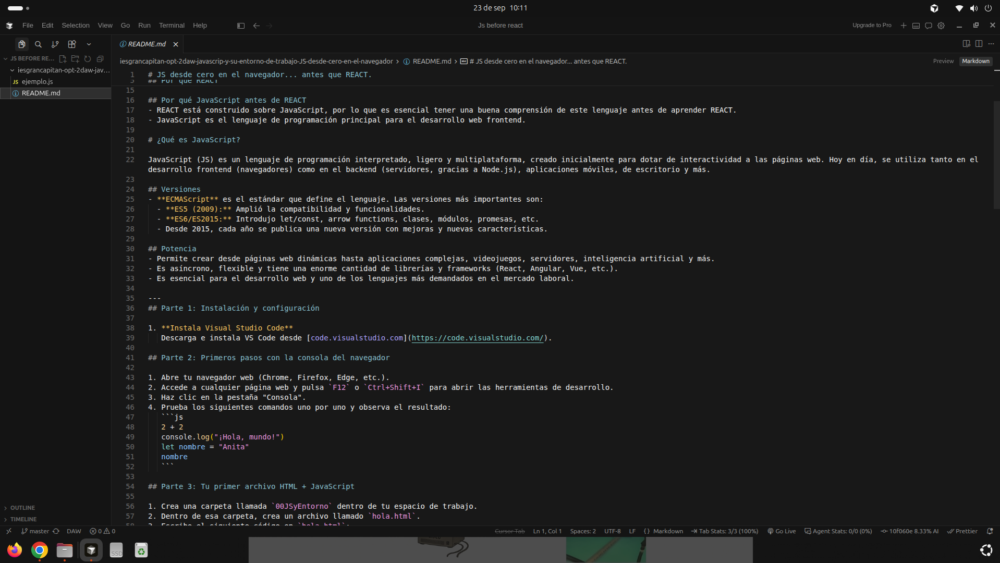
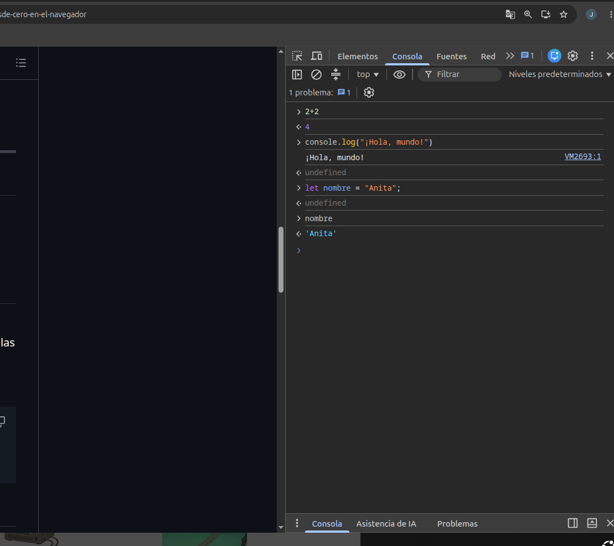
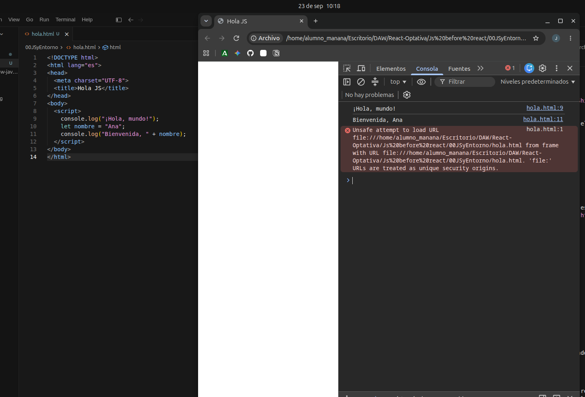
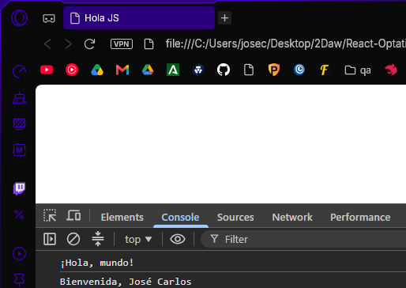
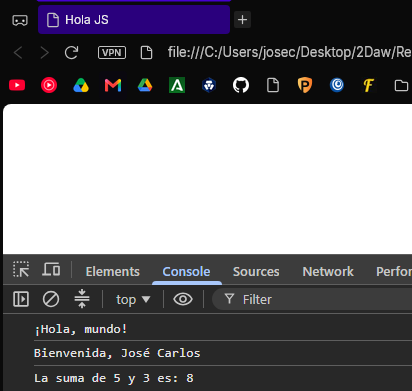
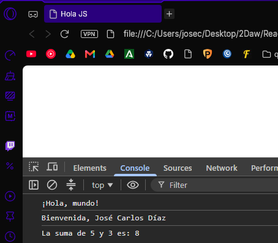
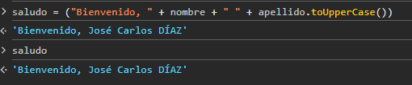
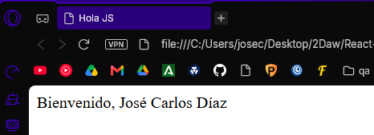
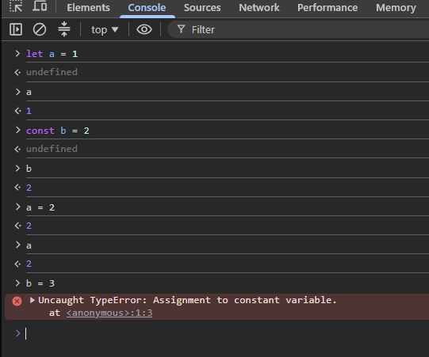

# JS desde cero en el navegador... antes que REACT.

El objetivo de esta práctica es crear un formulario básico en HTML y JavaScript que permita saludar a un usuario. Publicarlo en un repositorio de GitHub con GitHub Pages. Todo debes documentarlo con un pantallazo en este mismo archivo y personalizarlo con tu tus datos personales.

## Por qué REACT

- REACT es una biblioteca de JavaScript para construir interfaces de usuario.
- Es mantenida por Meta y una comunidad de desarrolladores.
- Permite construir componentes reutilizables.
- Es ampliamente utilizada en la industria, lo que la hace relevante para desarrolladores web.
- Aprender REACT abre oportunidades laborales y mejora las habilidades en desarrollo frontend.
- Cuenta con un ecosistema robusto, incluyendo herramientas como Redux para la gestión del estado y React Router para la navegación.
- Tiene un rendimiento optimizado gracias a su uso del Virtual DOM.
- Se sitúa como uno de los frameworks más populares en la actualidad. [State of JS 2023](https://2023.stateofjs.com/en-US/libraries/front-end-frameworks/)


## Por qué JavaScript antes de REACT

- REACT está construido sobre JavaScript, por lo que es esencial tener una buena comprensión de este lenguaje antes de aprender REACT.
- JavaScript es el lenguaje de programación principal para el desarrollo web frontend.


# ¿Qué es JavaScript?

JavaScript (JS) es un lenguaje de programación interpretado, ligero y multiplataforma, creado inicialmente para dotar de interactividad a las páginas web. Hoy en día, se utiliza tanto en el desarrollo frontend (navegadores) como en el backend (servidores, gracias a Node.js), aplicaciones móviles, de escritorio y más.

## Versiones

- **ECMAScript** es el estándar que define el lenguaje. Las versiones más importantes son:
  - **ES5 (2009):** Amplió la compatibilidad y funcionalidades.
  - **ES6/ES2015:** Introdujo let/const, arrow functions, clases, módulos, promesas, etc.
  - Desde 2015, cada año se publica una nueva versión con mejoras y nuevas características.


## Potencia

- Permite crear desde páginas web dinámicas hasta aplicaciones complejas, videojuegos, servidores, inteligencia artificial y más.
- Es asíncrono, flexible y tiene una enorme cantidad de librerías y frameworks (React, Angular, Vue, etc.).
- Es esencial para el desarrollo web y uno de los lenguajes más demandados en el mercado laboral.

---


## Parte 1: Instalación y configuración

1. **Instala Visual Studio Code**
  Descarga e instala VS Code desde [code.visualstudio.com](https://code.visualstudio.com/).
   


## Parte 2: Primeros pasos con la consola del navegador

1. Abre tu navegador web (Chrome, Firefox, Edge, etc.).
2. Accede a cualquier página web y pulsa `F12` o `Ctrl+Shift+I` para abrir las herramientas de desarrollo.
3. Haz clic en la pestaña "Consola".
4. Prueba los siguientes comandos uno por uno y observa el resultado:
  ```js
   2 + 2
   console.log("¡Hola, mundo!")
   let nombre = "Anita"
   nombre
  ```
  


## Parte 3: Tu primer archivo HTML + JavaScript

1. Crea una carpeta llamada `00JSyEntorno` dentro de tu espacio de trabajo.
2. Dentro de esa carpeta, crea un archivo llamado `hola.html`.
3. Escribe el siguiente código en `hola.html`:
  ```html
   <!DOCTYPE html>
   <html lang="es">
   <head>
     <meta charset="UTF-8">
     <title>Hola JS</title>
   </head>
   <body>
     <script>
       console.log("¡Hola, mundo!");
       let nombre = "Ana";
       console.log("Bienvenida, " + nombre);
     </script>
   </body>
   </html>
  ```
4. Desde VSCode abre el archivo `hola.html` en tu navegador.
5. Observa el resultado en la consola del navegador.



## Parte 4: Experimenta

- Cambia el valor de la variable `nombre` por el tuyo y recarga la página.



- Añade una línea que sume dos números y muestre el resultado con `console.log`.



- Añade otra variable con tu apellido y muestra un saludo completo.



- Modifica el saludo para que incluya el apellido en mayúsculas. Busca en la consola cómo convertir una cadena a mayúsculas. Para ello usa un literal de cadena (con tu nombre) seguido del operador punto (`.`)



- Modifica el archivo para que el saludo se muestre en la página web en lugar de la consola. Usa `document.body.innerHTML` para esto:



- Publica tu proyecto en el repositorio de GitHub y usa GitHub Pages para alojarlo. Sigue [esta guía](https://docs.github.com/es/pages/getting-started-with-github-pages/creating-a-github-pages-site) para hacerlo.


## parte 5: formulario HTML + JavaScript

1. Crea un archivo llamado `formulario.html` en la misma carpeta `00JSyEntorno`.
2. Crea un archivo llamado `formulario.js` en la misma carpeta `00JSyEntorno`.
3. Escribe el siguiente código en `formulario.html`:
4. ```html
  # Formulario de Saludo
  Nombre: Saludar
  ```
5. Escribe el siguiente código en `formulario.js`:
  ```js
   document.addEventListener('DOMContentLoaded', function() {
     document.getElementById('formulario').addEventListener('submit', function(event) {
       event.preventDefault();
       const nombre = document.getElementById('nombreInput').value;
       document.getElementById('salida').textContent = '¡Hola, ' + nombre + '!';
     });
   });
  ```
6. Desde VSCode abre `formulario.html` en tu navegador y prueba el formulario.
  

## Parte 6: Preguntas de reflexión

1. ¿Qué hace `console.log`?
  - Muestra en la consola del navegador alguna variable.

2. ¿Qué ocurre si cambias el valor de la variable desde la consola? ¿Se puede?
  - Desde la consola se puede cambiar, aunque no modificará el archivo original.

3. ¿Para qué sirve la consola del navegador en este contexto?
  - Sirve para debbugear y hacer pruebas sobre el código sin necesidad de acceder a este, cambiar variables o probar funciones, por ejemplo.

4. Para qué sirve el archivo HTML en este contexto?
  - Para formatear la página y mostrar los elementos con los que interactua el código JavaScript.

5. ¿Por qué es una buena práctica separar el código JavaScript del HTML?
  - Para encapsularlo, por seguridad y rendimiento de la propia página, así el navegador no tiene que parar a cargar todas las líneas de script que le incrustemos.

6. Por qué se llama Vanilla JavaScript?
  - Se llama así porque es el original, sin ninguna extensión ni plugin que lo modifique.

7. Cuándo se usa JavaScript puro y cuándo se usan frameworks o librerías como REACT?
  - Depende de las necesidades de cada proyecto, para hacer ciertas dinámicas sencillas o algún código ligero, no es necesario instalar un framework completo y sus librerías. </br>En el caso de querer hacer un proyecto más profesional y complejo, por ejemplo siguiendo el modelo vista-controlador, son una gran ayuda ya que nos brindan una enorme cantidad de herramientas nuevas que usar de manera estandar.

8. Cómo se define una función en JS
  - function nombre(){}

9. Sobre el código demuestra la diferencia entre let y const
  - La diferencia sobre let y const es que let declara una variable mutable, mientras que const será un valor inmutable, en la imagen podemos observar que al intentar cambiar el valor de b la consola nos devuelve un TypeError, ya que no se puede modificar su valor.

  


10. Indica en el código:
  1. Si puede evitarse el uso de let. Qué hace
  - Si no se usa let, el ambito de esa variable será global, por lo que hay que tener cuidado con qué funciones, métodos u objetos la usan.

  2. Cuántos eventos hay en el código, cuáles son y para qué sirven
  - En el código encontramos 2 eventos:
    - DOMContentLoaded
    Permite usar el script en la página una vez que el fichero HTML haya sido cargado por completo.
    - Submit
    Submit se activa cuando el usuario intenta enviar el formulario y recoge los datos de los campos para que puedan ser usados en la función.
